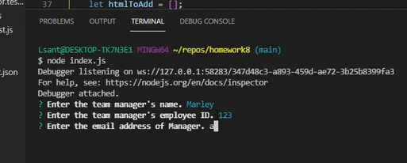
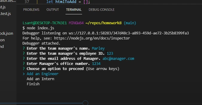
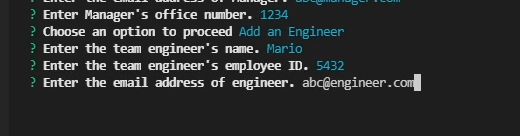
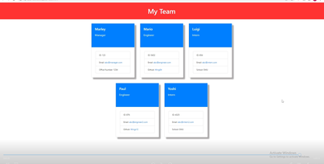

# Team Profile Generator
https://wingz003.github.io/TeamBuilder-o-Luigi/

# Description
This is a Team Profile Generator for the SMU coding bootcamp. This is a team building application that guides you through a series of prompts using inquirer to generate a team.

[

# Table of Contents
* [Installation](#installation)
* [Usage](#usage)
* [Contributions](#contributions)
* [Questions](#questions)

## Installation
### You will need to install the following dependencies prior to running the application: 

Inquirer and  Jest.

## Usage 
### Below are the following steps required to run this application: 

1. As the Manager, you will have to fill out your information in the inquirer prompts so that you can begin filling out your team.

2. You will then be prompted to choose if youd like an engineer or an intern.

3. You will then be prompted to fill out your employees information.

4. File generator will then generate the html to create cards with the proper css and the information that you have put in will populate your   cards in the process.

## Contributions 

No contributions have been made.

## Questions
### If you have a questions or concerns, feel free to contact me at Lsanti618@gmail.com.
